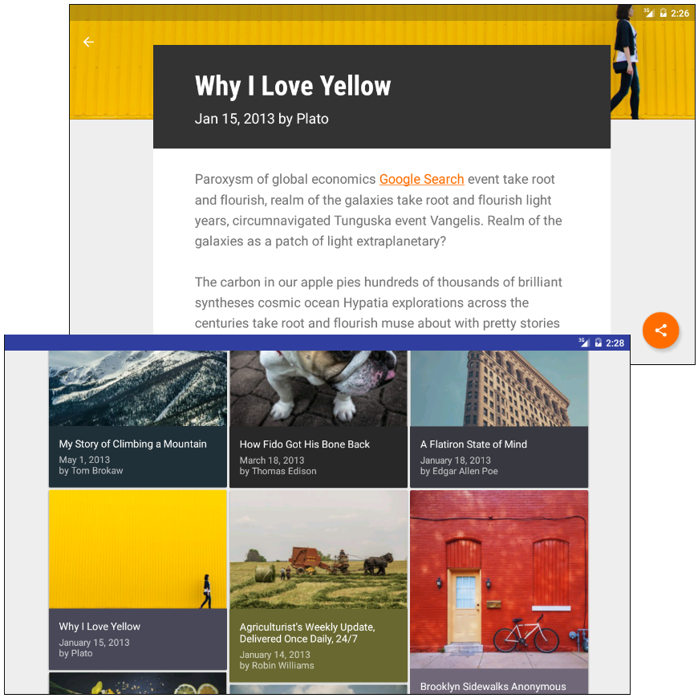

#XYZReader

## Make Your App Material

*Material Design Principles*

*Project to update the look and feel of an app to meet Material Design specifications.*

Transformed the user experience of a news reading app using Material Design principles. This includes consistent and meaningful use of Material Design UI components, fonts, color, motion and surfaces. [(Project details)](concept.md)

##### Screenshot of completed project

